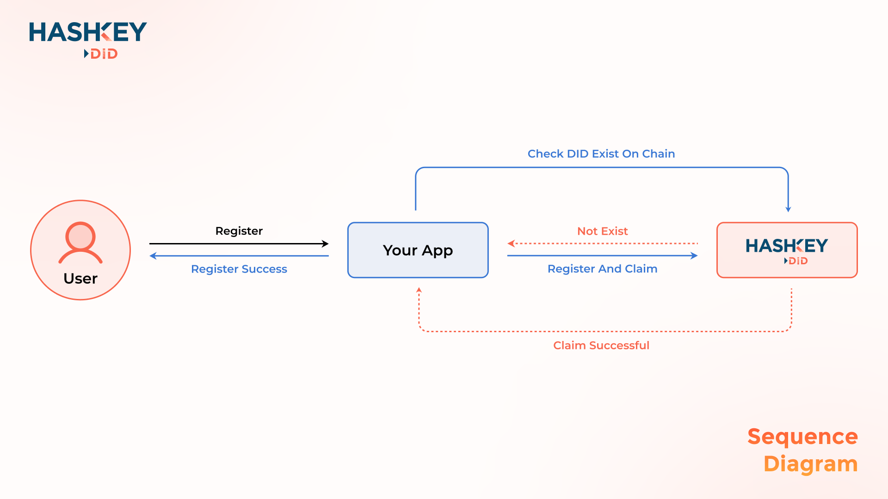

# Register

## Sequence Diagram

<figure><figcaption></figcaption></figure>

## Step by step

### Preparation

For DID registration, user need provide information below:

* DID: A string as user's DID, suffix is .key, only can contains lower alphabets and numbers, at least, at least 5 characters.
* Username: A string as user's Display Name, only can contains alphabets, at least 1 character and maximum is 50 characters.
* Avatar Parts: User could select a head, a body and a footer to create their owner avatar,
  * head\_photos: https://static.hashkey.id/resources/images/fireworks/cartoon/header\_{number}.png (i.e. https://static.hashkey.id/resources/images/fireworks/cartoon/header\_1.png), 1 to 40.
  * body\_photos: https://static.hashkey.id/resources/images/fireworks/cartoon/body\_{number}.png (i.e. https://static.hashkey.id/resources/images/fireworks/cartoon/body\_1.png) 1 to 40.
  * footer\_photos: https://static.hashkey.id/resources/images/fireworks/cartoon/footer\_{number}.png (i.e. https://static.hashkey.id/resources/images/fireworks/cartoon/footer\_1.png) 1 to 40
* Background Color: https://static.hashkey-qa.id/resources/images/app/card/selection/{number}.svg (i.e. https://static.hashkey-qa.id/resources/images/app/card/selection/1.svg) 1 to 8

### Check DID Exist

Invoke [Check DID Exist API](../api-reference/openapi.md#get-user-didexistchain) to check if DID exist on chain.

### Register and Claim DID

Invoke [Get Register Claim Sign Text](../api-reference/openapi.md#get-user-getregisterclaimsigntext) to get sign text.

Let user do personal\_sign to whole signText

And using sign result and signId to invoke [Register And Claim](../api-reference/openapi.md#post-user-registerandclaim) to register and claim a DID .
