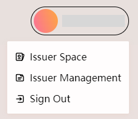

# Edit issuer info

After you become a HashKey DID‘s credential issuer, there will be two new additions on your personal menu, Issuer Space and Issuer Management.

<figure><figcaption>
Issuer personal menu
</figcaption></figure>

Click"**Issuer Space**", you will enter your own specific issuer space.&#x20;

Click"**Issuer Management**", you will enter a management center where you can create and issue credentials, please refer to [here](issuer-a-credential/) for details.

## Issuer Space

<figure><figcaption>
Issuer Space
</figcaption></figure>

In your issuer space, except to see your issued credentials and deployed contracts, you can also set up some basic information about the issuer by clicking '**Edit**'.

<figure><figcaption>
Edit issuer info
</figcaption></figure>

Instructions for each field:

| Field name    | Mandatory or optional                     | Field description                                                                                                         |
| ------------- | ----------------------------------------- | ------------------------------------------------------------------------------------------------------------------------- |
| Logo          | Optional                                  | Upload the profile picture of the issuer. The file formats supported by are JPG, JPEG and GIF with a maximum size of 4MB. |
| Name          | <mark style="color:red;">Mandatory</mark> | Name of the issuer, Support English alphabet, numbers, "\_", "-" and space.                                               |
| Description   | Optional                                  | Description of issuer background in detail. With a maximum of 500 characters.                                             |
| Official link | Optional                                  | The official link of the issuer, like the link of the official website.                                                   |
| Twitter       | Optional                                  | The link of the issuer’s official Twitter account.                                                                        |
| Email address | <mark style="color:red;">Mandatory</mark> | This email address is for HashKey DID to contact you. Please make sure it is in use.                                      |
