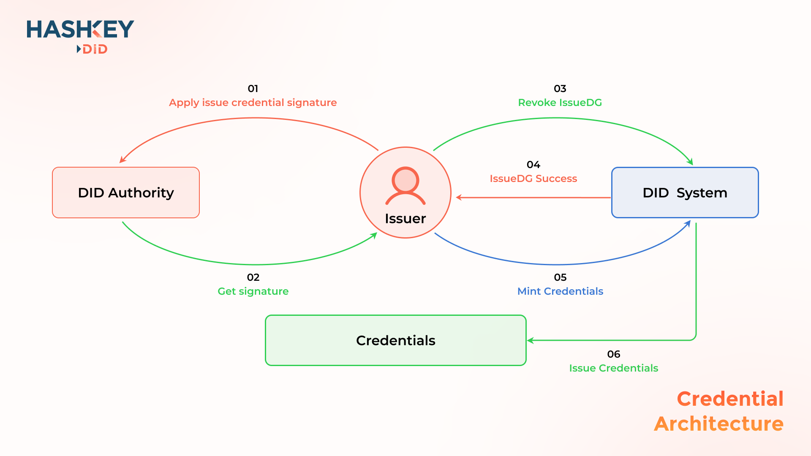

# Credential

DID users want to publish commemorative badges or NFTs for an event, or they want to publish credentials for someone who achieved an accomplishment.

### Architecture

<figure><figcaption></figcaption></figure>

### Issue Credential

To issue a commemorative badge or NFT for an event, the issuer only needs to contact the official HashKey DID with his address, and obtain the official signature information from HashKey DID. Issuer can invoke DID contract with signature to publish his credentials. For more details, please visit Publish Credential.
