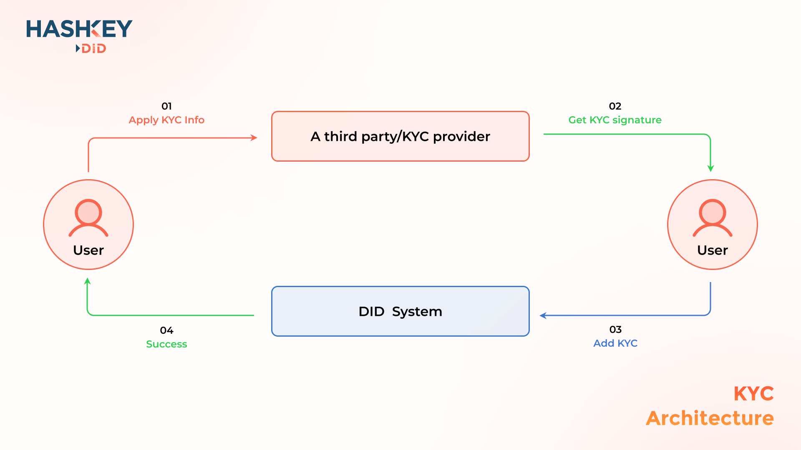

# KYC

### Introduce

KYC stands for Know Your Customer, and sometimes Know Your Client. KYC, or KYC check, is a useful process for identifying and verifying a client's identity when opening an account and periodically over time. In contrast to the traditional business industry, KYC certification is optional in HashKey DID.

### Architecture

<figure><figcaption></figcaption></figure>

### How to add KYC

If DID user want to add KYC, you need to contact KYC provider and send the required parameters to KYC provider. KYC provider will sign the parameters with private key. User call the DID contract to add KYC with signature from KYC provider. For more details, please visit Add KYC.

### KYC Providers

The following are our KYC providers (in no particular order):

### 1. HashKey Xpert

**Intro:**\
****A technology-focused brokerage service platform that provides comprehensive coverage to digital asset markets and products for professional and institutional investors.

**Website:**\
****[https://www.hashkey.com/en/hashkey-xpert.html](https://www.hashkey.com/en/hashkey-xpert.html)

**Address:**

****

### 2. OneCash

**Intro:**\
OneCash provides users with secure digital asset custody through a comprehensive and leading KYC\&AML system, using a variety of financial technology tools.

**Website:**\
[https://www.onecash.asia/](https://www.onecash.asia/)

**Address:** \
0x0FC1021d0B7111f2170d1183367AAcaC26c68888
