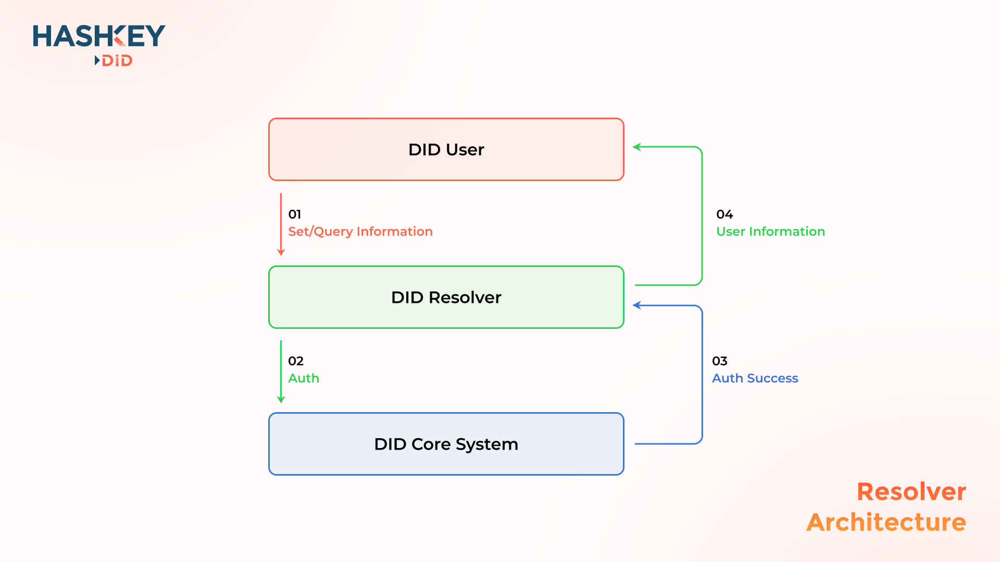

# Resolver

Introduce

Resolver contract records the DID user personal information (eg: `name`, `avatar`, `blockchain address`). DID user can display the personal information by resolver contract. all of the information is optional.

### Architecture

<figure><figcaption></figcaption></figure>

### Core

The `tokenId` is used as the core to bind all information together. TokenId and DID are one-to-one mappings relationship in the DID contract. DID is essentially a non-transferable NFT. Setting DID resolver information is equivalent to setting additional metadata for NFTS.
